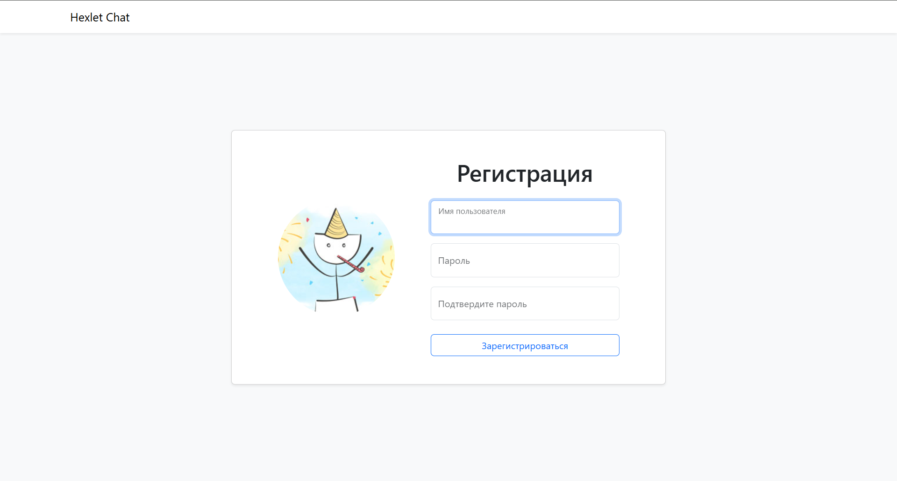
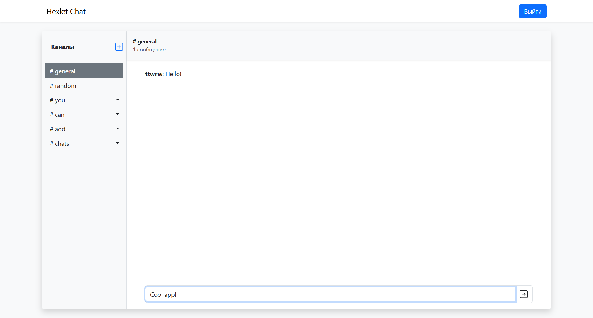

## Project "Hexlet Chat"

The project is a web-app, built with React and Redux. Users can create channels, exchange messages in real time and manage their chats.  

  

  

You can try it by [link](https://frontend-project-12-h0r4.onrender.com/)  
 
### Hexlet tests and linter status:
  
